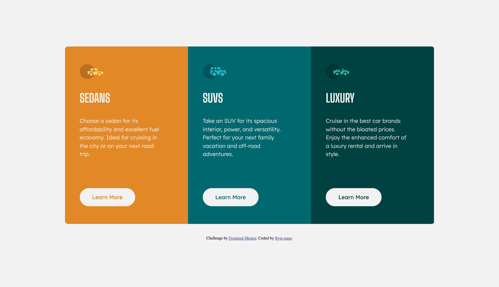
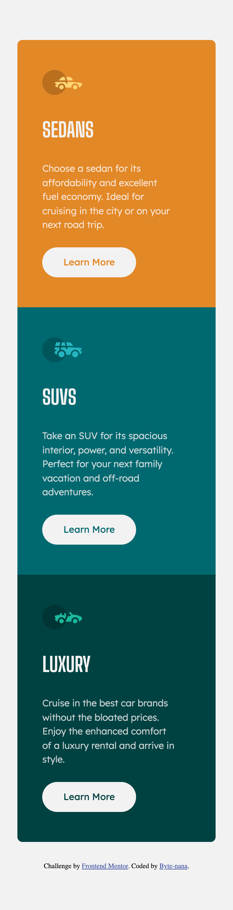

# Frontend Mentor - 3-Column Preview Card Component

This is a solution to the [3-Column Preview Card Component challenge on Frontend Mentor](https://www.frontendmentor.io/challenges/3column-preview-card-component-pH92eAR2).  
It showcases a set of clean, responsive cards for three vehicle types — Sedans, SUVs, and Luxury cars — each with distinct colours, icons, and call-to-action buttons.

This project is part of my **Front-End Practice Series**, focusing on reusable card components, colour systems, and responsive layouts using both media queries and container queries.

---

## 📚 Table of Contents

- [Overview](#overview)
  - [Screenshots](#screenshots)
  - [Links](#links)
- [Tech Stack](#tech-stack)
- [My Process](#my-process)
  - [Main Features](#main-features)
  - [What I Learned](#what-i-learned)
  - [Challenges and Problem-Solving](#challenges-and-problem-solving)
- [Author](#author)

---

## Overview

A responsive **three-column card layout** built using **HTML5**, **CSS3**, and semantic structuring.  
Each card highlights one vehicle category with its own colour theme and button styling.  
The project focuses on typography, colour contrast, and modern responsive techniques, including **container queries** for refined scaling.

### Screenshots

**Desktop View**  

**Mobile View**  

### Links

- **Repo URL:** [https://github.com/Byte-nana/front-end-practice/tree/main/3-column-preview-card-component-main](https://github.com/Byte-nana/front-end-practice/tree/main/3-column-preview-card-component-main)
- **Live Site URL:** [https://byte-nana.github.io/front-end-practice/3-column-preview-card-component-main/](https://byte-nana.github.io/front-end-practice/3-column-preview-card-component-main/)

---

## Tech Stack

- **HTML5** – semantic card structure
- **CSS3** – colour tokens, container queries, media queries

---

## My Process

### Main Features

- Three fully styled card components with unique brand colours
- Responsive behaviour using:
  - **mobile-first media queries**
  - **container queries** for more precise component scaling
- Hover and active button states that adapt to brand colours
- Clean, readable typography hierarchy using two font families

### What I Learned

- How to use **container-type** and **@container** rules to improve responsiveness inside individual components.
- Refining spacing and font sizes without hardcoding values at multiple breakpoints.
- Using flexible units (`rem`, `inline-size`, `container-width`) for more natural scaling.
- Managing consistent button and colour styling across variations.

### Challenges and Problem-Solving

- A key challenge was ensuring all three cards remained visually balanced across different screen sizes.
- Using container queries allowed each card to scale independently rather than relying solely on viewport-based media queries.
- This approach kept the layout flexible and prevented oversized typography on medium screens.

## Author

- GitHub – [Byte-nana](https://github.com/Byte-nana)
- Frontend Mentor – [@Byte-nana](https://www.frontendmentor.io/profile/Byte-nana)
