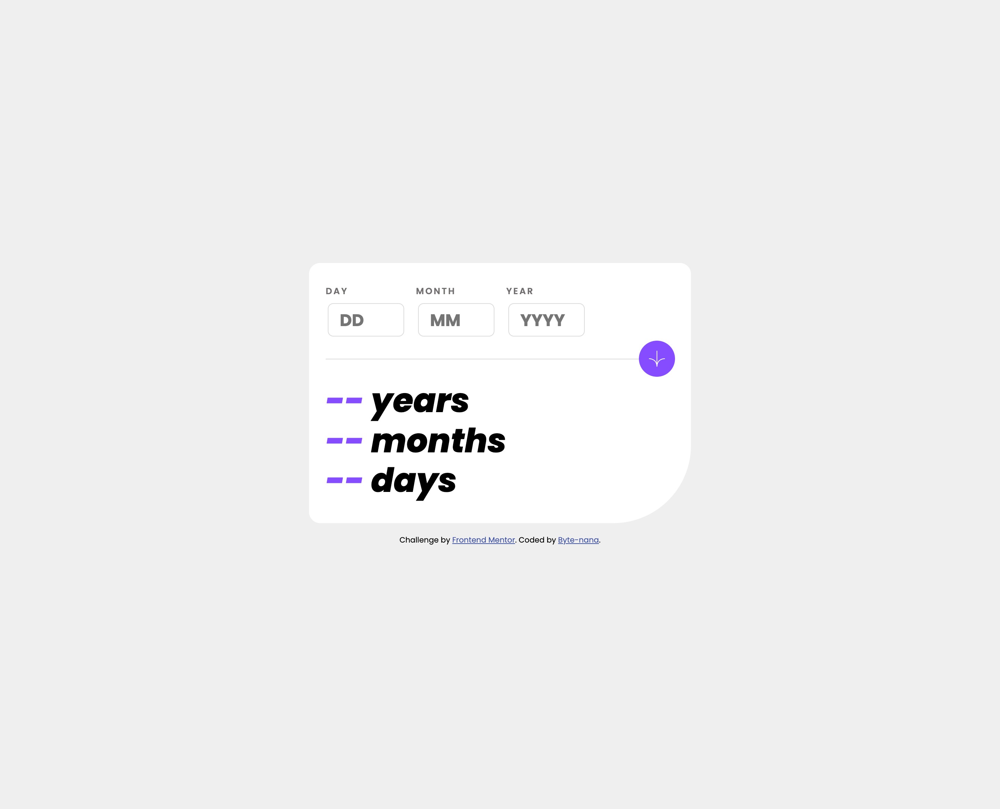

# Frontend Mentor - Age Calculator App

This is a solution to the [Age Calculator App challenge on Frontend Mentor](https://www.frontendmentor.io/challenges/age-calculator-app-dF9DFFpj-Q).  
It allows users to enter a day, month, and year, validates each field step-by-step, and calculates their age in **years**, **months**, and **days**.

This project is part of my **Front-End Practice Series**, focusing on form validation, error handling, and clean UI behaviour with vanilla JavaScript.

---

## 📚 Table of Contents

- [Overview](#overview)
  - [Screenshots](#screenshots)
  - [Links](#links)
- [Tech Stack](#tech-stack)
- [My Process](#my-process)
  - [Main Features](#main-features)
  - [What I Learned](#what-i-learned)
  - [Challenges and Problem-Solving](#challenges-and-problem-solving)
- [Author](#author)

---

## Overview

A minimal and responsive age calculator built with **HTML**, **CSS**, and **JavaScript**.  
Users can input any valid past date, and the app returns a clean breakdown of their exact age.  
The form includes real-time validation, dynamic error messages, and calculation logic that accounts for month lengths and leap years.

### Screenshots

**Desktop View**  

**Mobile View**  

### Links

- **Demo Video:**  
  [🎥 Watch Demo on Loom](https://www.loom.com/share/a65d9aa9f95a4d5491a48e982df0652e)
- **Repo URL:** [📁 Github repository](https://github.com/Byte-nana/front-end-practice/tree/main/age-calculator-app-main)
- **Live Site URL:** [🕸️ Live site](https://byte-nana.github.io/front-end-practice/age-calculator-app-main/)

---

## Tech Stack

- **HTML5** – semantic, accessible form structure
- **CSS3** – responsive layout, custom colour tokens, and error states
- **Vanilla JavaScript** – validation, error handling, age calculation logic

---

## My Process

### Main Features

- Three separate input fields (`DD / MM / YYYY`) with clear labels
- Validation system that checks:
  - Empty fields
  - Invalid numbers (e.g., day > 31, month > 12)
  - Invalid combined dates (e.g., 31 Feb)
  - Future dates
- Live error messages under each input
- Age calculation that dynamically updates the displayed **years**, **months**, and **days**

---

## What I Learned

The core learning point was designing **modular validation logic** instead of relying on one large block.  
I broke validation into several small, readable functions:

1. **Empty field check** – ensures no inputs are left blank.
2. **Individual validity check** – validates day, month, and year separately.
3. **Real date validation** – ensures impossible dates like _31/02/2024_ are rejected.
4. **Past date validation** – prevents future dates.

This structure helped create cleaner, more maintainable code.

---

## Challenges and Problem-Solving

### **1. Avoiding Repetition (DRY Principle)**

I created helper functions (`showErrorAlert()`, `removeErrorAlert()`, `checkEmptyField()`) to reduce duplication.  
Some repetition still exists, so I plan to refactor with a more compact validation schema.

### **2. Naming for Readability**

I used clear, explicit names such as:  
`isValidDay()`, `checkPastDate()`, `ageCalculator()`  
to improve readability and long-term maintainability.

### **3. Improved Through Googling + AI Support**

I refined the validation logic by researching best practices and asking AI for modularisation tips.  
This helped improve structure, accuracy, and readability.

---

## Author

Developed by **Byte-nana**  
Front-End Developer | HTML • CSS • JavaScript

- GitHub – [Byte-nana](https://github.com/Byte-nana)
- Frontend Mentor – [@Byte-nana](https://www.frontendmentor.io/profile/Byte-nana)

---
