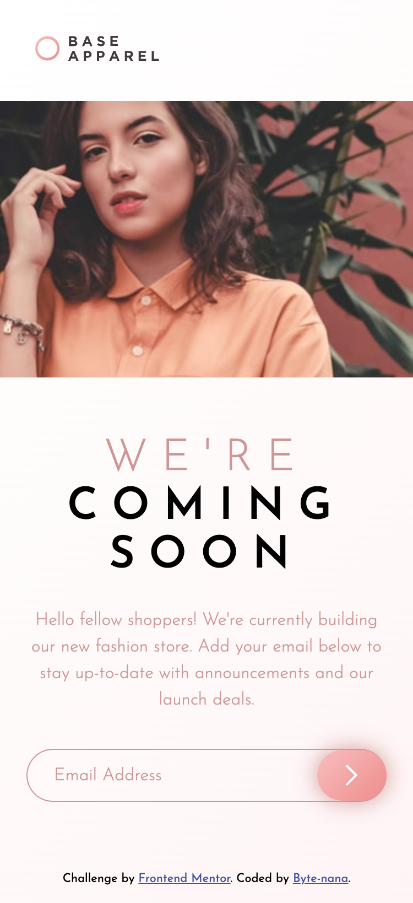
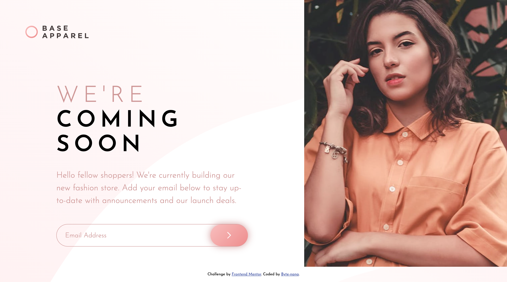

# Frontend Mentor - Base Apparel coming soon page solution

This is a solution to the [Base Apparel coming soon page challenge on Frontend Mentor](https://www.frontendmentor.io/challenges/base-apparel-coming-soon-page-5d46b47f8db8a7063f9331a0).

## Table of contents

- [Overview](#overview)
  - [Screenshot](#screenshot)
  - [Links](#links)
- [My process](#my-process)
  - [Built with](#built-with)
  - [What I learned](#what-i-learned)
  - [Continued development](#continued-development)
- [Author](#author)

## Overview

A responsive landing page for Base Apparel with a hero image, branding, description, and an email subscription form. Includes custom email validation with error states and adaptive layout for mobile and desktop screens.

### Screenshot




### Links

- Solution URL: [https://your-repo-url.com](https://your-repo-url.com)
- Live Site URL: [https://your-live-site-url.com](https://your-live-site-url.com)

## My process

### Built with

- Semantic **HTML5** and `<form>` with `novalidate`
- **CSS custom properties**
- **Clamp** for font sizes, margin, and padding
- **CSS Grid** for desktop layout
- **Mobile-first workflow**
- **Vanilla JavaScript** for controlled email validation

### What I learned

#### HTML

- At first, I wrapped the input in a `<label>`, then refactored to a semantic `<form>` structure with `novalidate` for **full control over validation**.
- Learned how to properly combine `<form>`, `<input>`, and `<button>` with custom validation logic in JS.

#### CSS

- Practiced **responsive design** using `clamp()` for scalable font sizes, margins, and padding:

```css
.title {
  font-size: clamp(2.5rem, 5vw, 4rem);
}
```

- Learned to restructure layout with **CSS Grid** for desktop, switching from a single column to a two-column design.
- Still finding it tricky to **align the logo and main content on the same left edge** when moving from mobile-first to desktop grid.

#### JavaScript

- Built a **custom email validation** system with regex while disabling native validation for full control.

```js
const emailRegex = /[a-zA-Z0-9._+-]+@[a-zA-Z0-9-]+\.[a-zA-Z0-9.]+/;

if (!emailRegex.test(email)) {
  // show error
} else {
  alert('Login successful');
}
```

- Created error messages dynamically and toggled error styles with `classList`.
- I want to further explore how to **cooperate with native validation** while still having flexibility.

### Continued development

- Solve the **desktop alignment issue**: ensuring the logo and main text align consistently in the grid layout.
- Explore better ways to integrate **native HTML form validation** with custom validation logic.

## Author

- GitHub – [Byte-nana](https://github.com/Byte-nana)
- Frontend Mentor – [@Byte-nana](https://www.frontendmentor.io/profile/Byte-nana)
