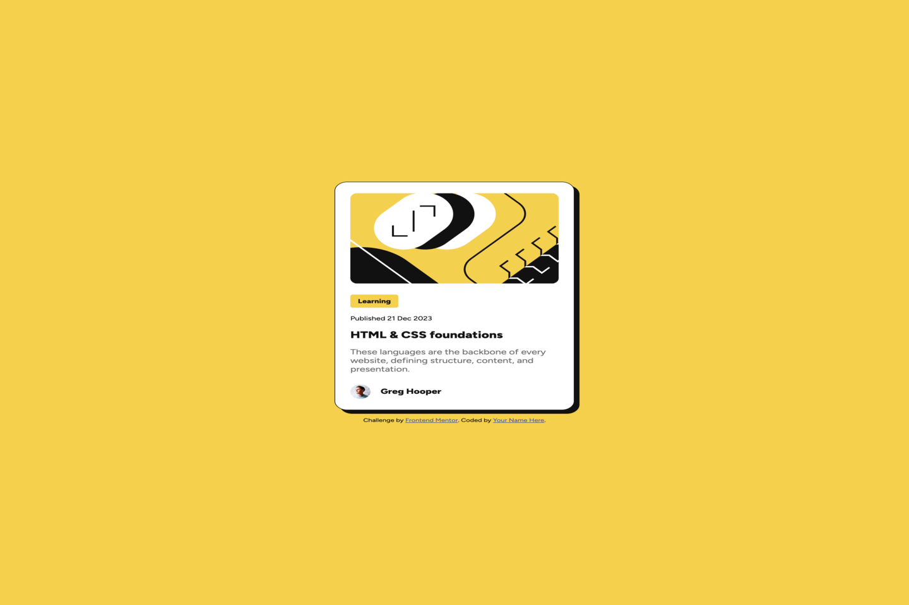
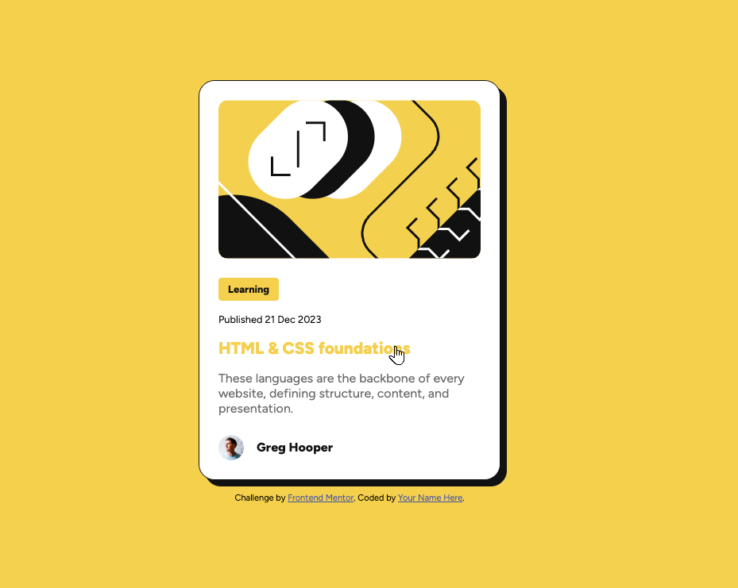
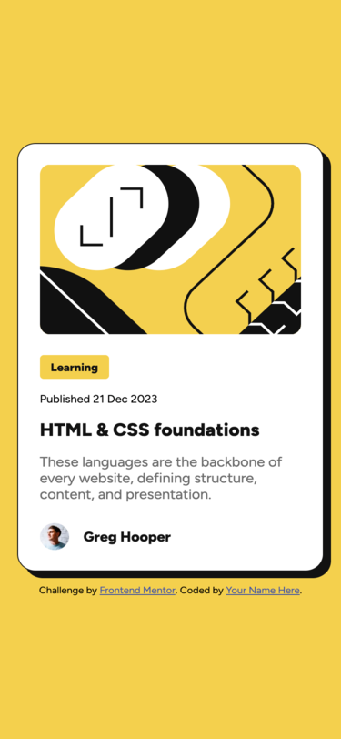

# Frontend Mentor - Blog preview card solution

This is a solution to the [Blog preview card challenge on Frontend Mentor](https://www.frontendmentor.io/challenges/blog-preview-card-ckPaj01IcS).

## Table of contents

- [Overview](#overview)
  - [Screenshot](#screenshot)
  - [Links](#links)
- [Tech stack](#tech-stack)
- [My process](#my-process)
  - [What I learned](#what-i-learned)
- [Author](#author)

## Overview

A simple and clean **Blog Preview Card** built with **HTML** and **CSS**.  
The challenge focuses on creating a visually appealing card layout with proper spacing, color contrast, and responsive behaviour.  
I used CSS custom properties (`:root` variables) to keep the design consistent and easily scalable — particularly for spacing and sizing units.

### Screenshot

**Desktop view**  


**Active state**  


**Mobile view**  


### Links

- **Github Repo URL:** [https://github.com/Byte-nana/front-end-practice/tree/main/blog-preview-card-main](https://github.com/Byte-nana/front-end-practice/tree/main/blog-preview-card-main)
- **Live Site URL:** [https://byte-nana.github.io/front-end-practice/blog-preview-card-main/](https://byte-nana.github.io/front-end-practice/blog-preview-card-main/)

## Tech stack

- **HTML5** – semantic and accessible markup
- **CSS3** – modular structure with custom properties
- **Responsive Design** – mobile-first workflow

## My process

### What I learned

- How to **unify spacing and sizing** using global CSS variables for better design consistency and scalability:

  ```css
  :root {
    --size-border: 0.5rem;
    --size-space: 0.5rem;
  }

  .card {
    padding: calc(var(--size-space) * 3);
    border-radius: calc(var(--size-border) * 2.5);
  }
  ```

- Refined understanding of hover vs. touch interaction using conditional media queries.

-Improved layout control using gap, calc(), and consistent unit scaling.

-Focused on using shadow and border radius combinations for depth and hierarchy.

## Author

👋 Developed by [Byte-nana](https://github.com/Byte-nana)  
Front-End Developer | HTML • CSS • JS • UI/UX

- GitHub – [Byte-nana](https://github.com/Byte-nana)
- Frontend Mentor – [@Byte-nana](https://www.frontendmentor.io/profile/Byte-nana)
