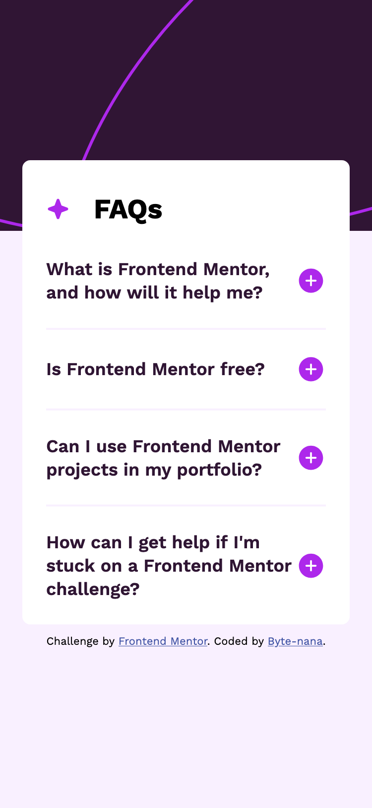
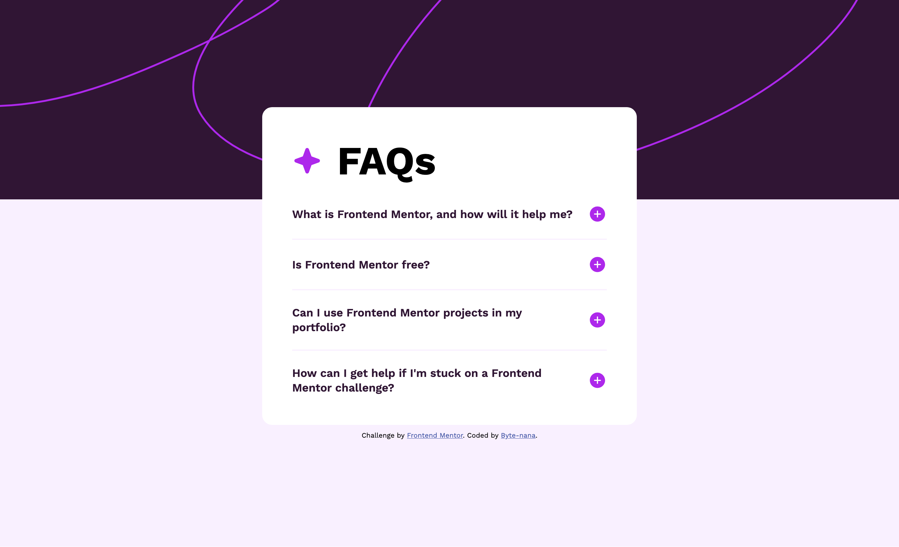

# Frontend Mentor - FAQ accordion solution

This is a solution to the [FAQ accordion challenge on Frontend Mentor](https://www.frontendmentor.io/challenges/faq-accordion-wyfFdeBwBz).

## Table of contents

- [Overview](#overview)
  - [Screenshot](#screenshot)
  - [Links](#links)
- [My process](#my-process)
  - [Built with](#built-with)
  - [What I learned](#what-i-learned)
  - [Continued development](#continued-development)
  - [Useful resources](#useful-resources)
- [Author](#author)
- [Acknowledgments](#acknowledgments)

## Overview

A responsive FAQ accordion card where users can expand/collapse questions. It supports desktop hover effects and mobile touch interactions. The background pattern adapts smoothly between screen sizes, and the accordion toggles icons from plus to minus when activated.

### Screenshot




### Links

- Solution URL: [repo url](https://github.com/Byte-nana/front-end-practice/tree/main/fm-faq-accordion)
- Live Site URL: [live site url](https://byte-nana.github.io/front-end-practice/fm-faq-accordion/)

## My process

### Built with

- Semantic **HTML5** for FAQ structure
- **CSS custom properties** for theme colors
- **Clamp & linear interpolation** for smooth background height changes
- **Media queries** for responsive breakpoints
- **JavaScript** for toggling FAQ answers, switching plus/minus icons, and mobile active states
- Mobile-first workflow

### What I learned

#### HTML

- Learned about **SVGs** and how to embed them as inline images or reference them in HTML.
- Understood how to manage `alt` text for better accessibility when using icons.

#### CSS

- Used the `clamp()` function and **linear interpolation** to create a smooth background height change from 232px (mobile) to 320px (desktop).
- Still practicing how to choose the **right breakpoints** for responsive design.

```css
--bg-height: clamp(232px, calc(232px + 0.0846 * (100vw - 400px)), 320px);
```

- Applied hover states for desktop with `:hover`, and styled active states for touch devices separately.

#### JavaScript

- Learned how to use **`dataset` attributes** to link titles, buttons, and answers.
- Practiced **event delegation** by attaching a single listener to the parent `<ul>`.
- Tried to **refactor** functions for cleaner, more modular code.
- Discovered how to implement a **mobile touch effect**: since CSS alone didn’t work, I added a `touchstart` event in JS to change the title color when active.

```js
// mobile active state
ul.addEventListener('touchstart', (e) => {
  let id = e.target.dataset.id;
  let result = answers[+id].classList.contains('show__answer');

  result ? h3[+id].classList.remove('active') : h3[+id].classList.add('active');
});
```

This ensures that when a question is activated on mobile, the title changes color, and when it’s deactivated, it returns to the original.

### Continued development

- Get more confident with **responsive breakpoints** and choosing the right ranges.
- Improve my understanding of **SVG handling** in CSS (scaling, coloring).
- Keep refining **JavaScript structure** for cleaner, more reusable code.
- Explore accessibility improvements, such as adding keyboard support for toggling questions.

## Author

- GitHub – [Byte-nana](https://github.com/Byte-nana)
- Frontend Mentor – [@yourusername](https://www.frontendmentor.io/profile/yourusername)
