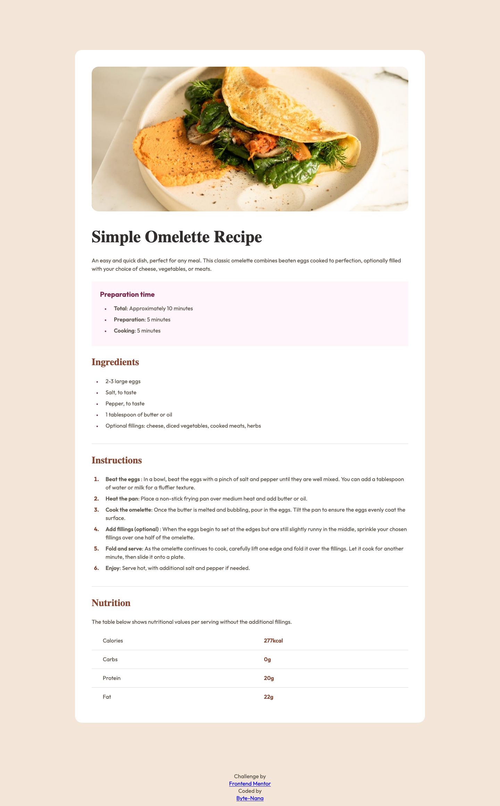
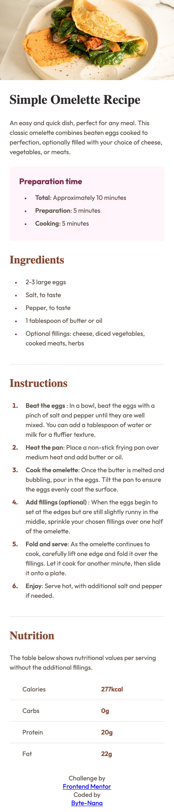

# Frontend Mentor - Recipe page solution

This is a solution to the [Recipe page challenge on Frontend Mentor](https://www.frontendmentor.io/challenges/recipe-page-KiTsR8QQKm). Frontend Mentor challenges help you improve your coding skills by building realistic projects.

## Table of contents

- [Overview](#overview)
  - [Screenshot](#screenshot)
  - [Links](#links)
- [My process](#my-process)
  - [Built with](#built-with)
  - [What I learned](#what-i-learned)
  - [Continued development](#continued-development)
  - [Useful resources](#useful-resources)
- [Author](#author)
- [Acknowledgments](#acknowledgments)

## Overview

A responsive, accessible recipe page showcasing semantic HTML, a typographic scale, and a small design-token system (colors, spacing, radii) implemented with CSS custom properties. Fonts are loaded from Google Fonts (Young Serif & Outfit), and the layout adapts from mobile to desktop with media queries.

### Screenshot

**Desktop view**



**Mobile view**



### Links

### Links

- Solution URL: [GitHub Repo](https://github.com/Byte-nana/frontend-mentor-recipe-page)

- Live Site URL: [Live Demo](https://byte-nana.github.io/frontend-mentor-recipe-page/)

## My process

### Built with

- Semantic HTML5 (sectioning: section, article, table)
- CSS custom properties (design tokens for color, type, spacing, radii)
- Mobile-first workflow with responsive media queries at 768px and 1200px
- System fonts: Young Serif (headings) & Outfit (body)

### What I learned

- **Design tokens with CSS variables** to centralize colors, font sizes, and spacing:

```css
:root {
  --colour-text-secondary: hsl(14, 45%, 36%);
  --font-scale-4: 1.75rem; /* 28px */
  --space-4: 1.5rem; /* 24px */
}
```

- Why it matters: a single source of truth for the visual system reduces duplication and prevents drift.

- **Styling list markers** directly with `::marker` for cleaner, more flexible lists:

```css
.instr__item::marker {
  color: var(--colour-text-secondary);
  font-weight: 700;
}
```

- Why it matters: improves readability without extra elements.

- **Mobile-first responsive design** with adaptive image and layout:

```css
.recipe__img {
  display: block;
  width: calc(100% + 48px);
  margin: -24px -24px 0;
}
@media (min-width: 768px) {
  .recipe__img {
    width: 100%;
    margin: 0;
    border-radius: var(--radii-1);
  }
}
```

- Why it matters: preserves visual impact on small screens while aligning with a card layout on desktop.

- **Accessible structure:** headings are hierarchical, recipe content is grouped into meaningful sections, and nutrition information is structured with semantic table markup.

### Continued development

- Add **print styles** for users who want to print the recipe.
- Enhance **focus states** and accessibility features.
- Experiment with **CSS container queries** for better spacing on medium screens.

### Useful resources

- [MDN Web Docs: `::marker`](https://developer.mozilla.org/en-US/docs/Web/CSS/::marker) – How to style list bullets/numbers.
- [Every Layout: The Stack](https://every-layout.dev/layouts/stack/) – Helped with vertical rhythm and spacing.

## Author

- Website – [Your Name](https://your-site.com)
- Frontend Mentor – [@yourusername](https://www.frontendmentor.io/profile/yourusername)
- Twitter – [@yourusername](https://www.twitter.com/yourusername)

## Acknowledgments

Thanks to the Frontend Mentor community for helpful discussions and feedback. Challenge assets and style guide provided the foundation for typography, colors, and responsive targets.
