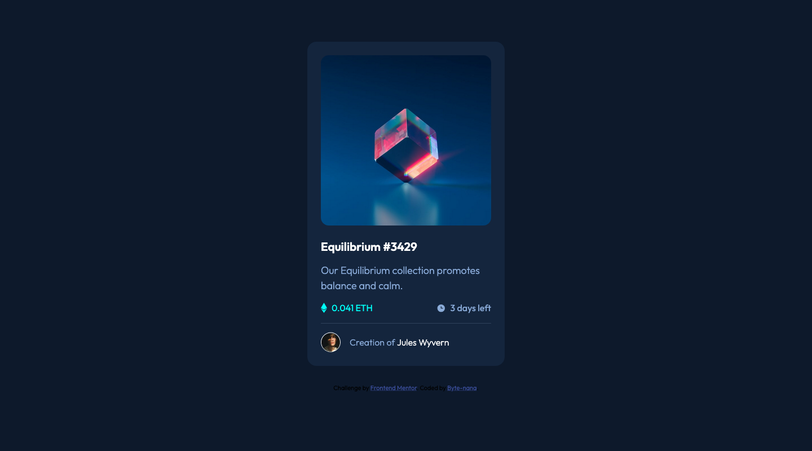
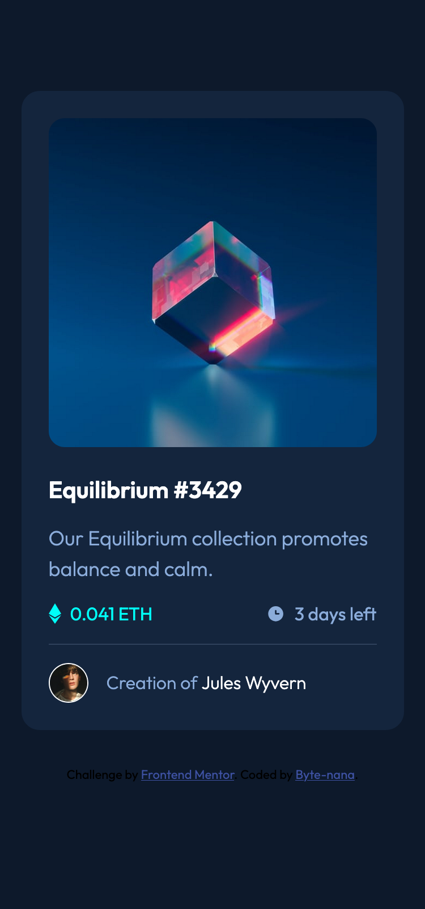

# Frontend Mentor - NFT preview card component solution

This is a solution to the [NFT preview card component challenge on Frontend Mentor](https://www.frontendmentor.io/challenges/nft-preview-card-component-SbdUL_w0U).  
This project showcases a clean, accessible, and fully responsive UI component built with semantic HTML, modular CSS, and subtle micro-interactions.

It’s part of my **Front-End Practice Series**, where I recreate professional layouts to sharpen my front-end development and design system skills.

---

## Table of contents

- [Overview](#overview)
  - [Screenshot & Live Demo](#screenshot--live-demo)
  - [Folder structure](#folder-structure)
  - [Links](#links)
- [Tech stack](#tech-stack)
- [Architecture](#architecture)
- [My process](#my-process)
  - [Main functions & interactions](#main-functions--interactions)
  - [What I learned](#what-i-learned)
  - [Challenges and problem solving](#challenges-and-problem-solving)
- [Author](#author)

---

## Overview

A responsive **NFT Preview Card Component** built with **HTML**, **CSS**. It displays an interactive NFT card with hover and tap animations, pricing details, and creator information. The focus is on responsive layout, smooth transitions, and balanced colour contrast for both desktop and mobile screens.

### Screenshot & Live Demo

**Desktop View**  


**Mobile View**  


**Live Demo**
[](https://www.loom.com/share/0ae79242bc844a428016b4ba66e4d4b8)

### Folder structure

```
.
├── css
│ └── style.css
├── design
│ ├── active-states.jpg
│ ├── desktop-design.jpg
│ └── mobile-design.jpg
├── images
│ ├── favicon-32x32.png
│ ├── icon-clock.svg
│ ├── icon-ethereum.svg
│ ├── icon-view.svg
│ ├── image-avatar.png
│ └── image-equilibrium.jpg
├── index.html
├── screenshot-desktop.png
├── screenshot-mobile.png
└── style-guide.md
```

### Links

- **Repo URL:** [https://github.com/Byte-nana/front-end-practice/tree/main/nft-preview-card-component-main](https://github.com/Byte-nana/front-end-practice/tree/main/nft-preview-card-component-main)
- **Live Site URL:** [https://byte-nana.github.io/front-end-practice/nft-preview-card-component-main/](https://byte-nana.github.io/front-end-practice/nft-preview-card-component-main/)

## Tech stack

- **HTML5** – semantic and accessible markup
- **CSS3** – layout, colour tokens, transitions, and responsive design

## My process

### Main functions & interactions

- **Image overlay effect:** On hover/tap, a translucent cyan overlay fades in with a centered “view” icon.
- **Interactive text states:** Title and creator name shift colour on hover for better affordance.
- **Responsive layout:** The card transitions seamlessly from a stacked mobile layout to a fixed two-column card on desktop.

### What I learned

- How to use rgb() values with transparency by defining RGB variables and dynamically applying alpha values.
  This makes it simple to reuse one colour token across different transparency levels without duplicating values.

### Challenges and problem solving

- **Responsive proportions:** Adjusted image and text spacing using object-fit: cover and fluid padding for consistent scaling.

- **Hover vs. touch behavior:** Used @media (hover: hover) and @media (hover: none) to make the overlay feel intuitive across devices.

## Author

- GitHub – [Byte-nana](https://github.com/Byte-nana)
- Frontend Mentor – [@Byte-nana](https://www.frontendmentor.io/profile/Byte-nana)
