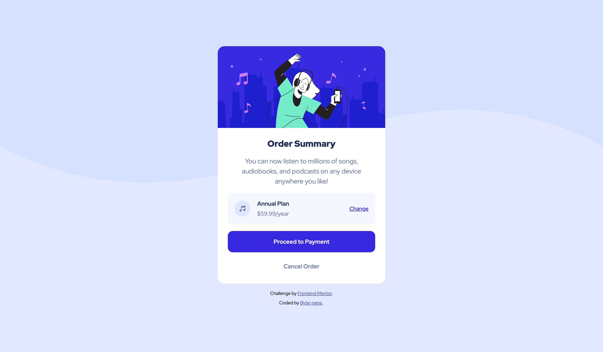
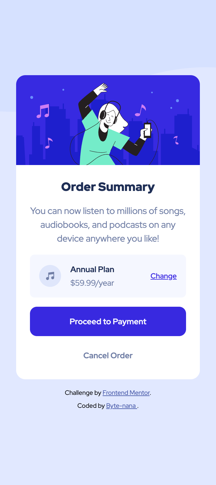

# 💳 Order Summary Card – _Frontend Mentor Challenge Solution_

This is a solution to the [_Order Summary Card challenge on Frontend Mentor_](https://www.frontendmentor.io/challenges/order-summary-component-QlPmajDUj).  
It presents a simple yet elegant order summary card with clean typography, responsive layout, and intuitive button interactions.

This project is part of my **Front-End Practice Series**, focusing on card-based UI design, visual hierarchy, and responsive backgrounds.

---

## 📚 Table of Contents

- [Overview](#overview)
  - [Screenshots](#screenshots)
  - [Links](#links)
- [Tech Stack](#tech-stack)
- [My Process](#my-process)
  - [Main Features](#main-features)
  - [What I Learned](#what-i-learned)
  - [Challenges and Problem-Solving](#challenges-and-problem-solving)
- [Author](#author)
- [Acknowledgements](#acknowledgements)

---

## 🪄 Overview

A responsive **Order Summary Card** component created using **HTML5** and **CSS3**.  
It features an adaptable layout that changes background patterns depending on the viewport size.  
The design focuses on clarity, visual contrast, and intuitive button feedback.

### Screenshots

**Desktop View**  

**Mobile View**  

### Links

- **Live Site URL:** [https://byte-nana.github.io/front-end-practice/order-summary-component/](https://byte-nana.github.io/front-end-practice/order-summary-component-main/)
- **GitHub Repository:** [https://github.com/Byte-nana/front-end-practice/tree/main/order-summary-component](https://github.com/Byte-nana/front-end-practice/tree/main/order-summary-component-main)

### Live Demo

- **Loom Demo Video:** [🎥 Watch Demo](https://www.loom.com/share/4648770876494e68b889ace0a6b330d7)

    <a href="https://www.loom.com/share/4648770876494e68b889ace0a6b330d7">
      
Frontend Mentor | Order summary card - 2 November 2025 - Watch Video

    </a>
    
  

---

## 🛠 Tech Stack

- **HTML5** – semantic, accessible structure
- **CSS3** – modern styling using variables and hover effects

---

## 💡 My Process

### Main Features

- Clean, centred card layout with background pattern
- Adaptive **mobile and desktop** backgrounds using media queries
- Interactive **“Change”** link and button hover states
- Consistent colour system defined with CSS variables

### What I Learned

- How to use **CSS variables** to manage colours and ensure design consistency.
- Practised **mobile-first responsive design**, switching background images dynamically.
- Refined understanding of **visual rhythm** and **padding balance** for readability.

### Challenges and Problem-Solving

One challenge was **ensuring proportional spacing across different screen sizes**.  
To address this, I used the `clamp()` and flexible units approach to keep the design visually stable on all devices.  
Additionally, hover and active button states were carefully adjusted for both **desktop and touch devices** to create a natural user experience.

---

## 👩‍💻 Author

Developed by [Byte-nana](https://github.com/Byte-nana)  
Front-End Developer | HTML • CSS • UI Design

- GitHub – [Byte-nana](https://github.com/Byte-nana)
- Frontend Mentor – [@Byte-nana](https://www.frontendmentor.io/profile/Byte-nana)

---

## 🙏 Acknowledgements

Thanks to [Frontend Mentor](https://www.frontendmentor.io) for providing the challenge resources and community feedback that help improve front-end design skills.
