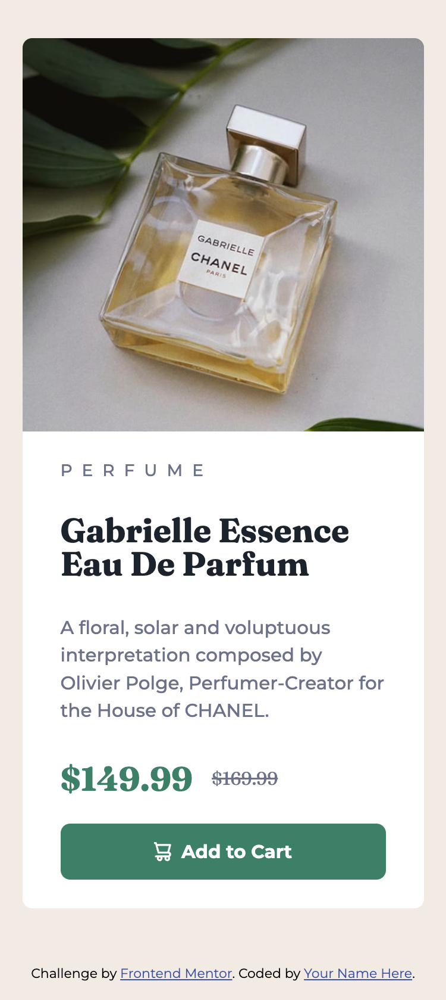
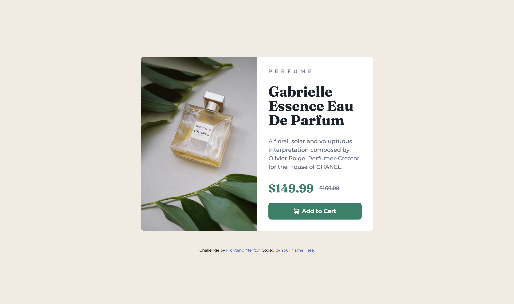

# Frontend Mentor - Product preview card component solution

This is a solution to the [Product preview card component challenge on Frontend Mentor](https://www.frontendmentor.io/challenges/product-preview-card-component-GO7UmttRfa).

## Table of contents

- [Overview](#overview)
  - [Screenshot](#screenshot)
  - [Links](#links)
- [My process](#my-process)
  - [Built with](#built-with)
  - [What I learned](#what-i-learned)
- [Author](#author)

## Overview

A responsive product preview card featuring a hero image, title, description, price comparison, and an “Add to Cart” button. The layout adapts from a single-column mobile card to a two-column desktop card, with accessible button states and typography styling.

### Screenshot




### Links

- Solution URL: [Github repo](https://github.com/Byte-nana/front-end-practice/tree/main/product-preivew-card-component-main)
- Live Site URL: [Github page](https://byte-nana.github.io/front-end-practice/product-preivew-card-component-main)

## My process

### Built with

- Semantic **HTML5** structure (`<section>`, `<main>`, `<picture>`)
- **CSS custom properties** for colors
- **Clamp()** for fluid typography and spacing
- **Flexbox** for layout alignment
- **Responsive images** with `<picture>` and `srcset`
- **Mobile-first workflow**

### What I learned

- How to use the `<picture>` element with media queries for **responsive images**:

```html
<picture class="card__product-img">
  <source
    srcset="./images/image-product-desktop.jpg"
    media="(width >= 768px)"
    type="image/jpeg"
  />
  
</picture>
```

- How to apply **fluid typography** with `clamp()`:

```css
.main__title {
  font-size: clamp(1.75rem, 5vw, 2.5rem);
}
```

- Improved understanding of **mobile-first responsive design**, starting with a stacked card and switching to a flex two-column layout at wider screens:

```css
@media screen and (min-width: 768px) {
  .card {
    display: flex;
    width: min(90%, 650px);
  }
  .card__product-img {
    width: 50%;
  }
  .card__main {
    width: 50%;
    display: flex;
    flex-direction: column;
    justify-content: center;
  }
}
```

- Styling **interactive button states** with hover, focus, and active effects for accessibility and usability.

## Author

- GitHub – [Byte-nana](https://github.com/Byte-nana)
- Frontend Mentor – [@Byte-nana](https://www.frontendmentor.io/profile/Byte-nana)
