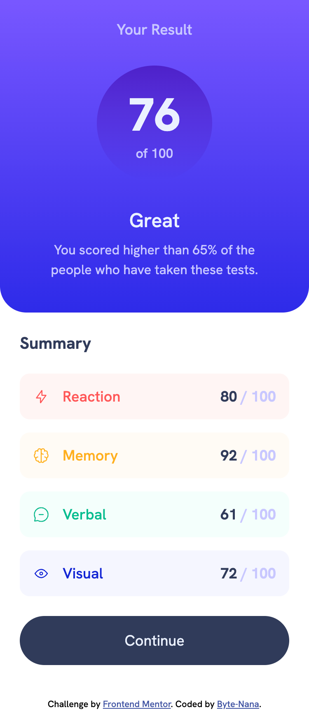
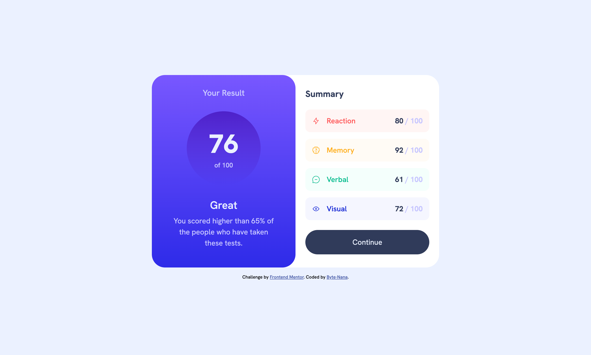

# Frontend Mentor – Results summary component solution

This is a solution to the [Results summary component challenge on Frontend Mentor](https://www.frontendmentor.io/challenges/results-summary-component-CE_K6s0maV).

## Table of contents

- [Overview](#overview)
  - [Screenshot](#screenshot)
  - [Links](#links)
- [My process](#my-process)
  - [Built with](#built-with)
  - [What I learned](#what-i-learned)
  - [Continued development](#continued-development)
  - [Useful resources](#useful-resources)
- [Author](#author)
- [Acknowledgments](#acknowledgments)

## Overview

A responsive “results + summary” card that displays a circular score on the left and a dynamically generated list of category scores on the right (loaded from `data.json`). The layout adapts from a stacked mobile view to a two-column desktop card, with gradient theming and interactive states.

### Screenshot




_Add a screenshot of your final UI here._

### Links

- Solution URL: [Solution](https://github.com/Byte-nana/front-end-practice/tree/main/results-summary-component-main)
- Live Site URL: [Live Demo](https://byte-nana.github.io/front-end-practice/results-summary-component-main)

## My process

### Built with

- Semantic **HTML5** structure (result panel + summary list)
- **CSS custom properties**, gradients, and fluid typography tweaks
- **Flexbox** layout with mobile-first media queries (768px, 991px)
- **Vanilla JS** `fetch` + DOM creation to render list items from JSON

### What I learned

- **Rendering from JSON with `fetch`**: mapping over data and building list items on the fly kept HTML minimal and made the summary reusable.

```js
fetch('./data.json')
  .then((res) => res.json())
  .then((data) => {
    const ul = document.querySelector('.summary__list');
    data.forEach((item) => {
      const li = document.createElement('li');
      li.setAttribute('class', 'list__item');
      li.innerHTML = `
        <div class="title__box">
          
          <span class="list__title">${item.category}</span>
        </div>
        <div class="score__box">
          <span class="list__score">${item.score} </span>
          <span class="list__total-score">/ 100</span>
        </div>`;
      ul.appendChild(li);
    });
  });
```

- **Gradient theming & tokens**: centralizing colors and gradients as CSS variables made it easy to tune the look and maintain contrast.

```css
:root {
  --bg-gradient: linear-gradient(hsl(252, 100%, 67%), hsl(241, 81%, 54%));
  --circle-gradient: linear-gradient(
    hsla(256, 72%, 46%, 1),
    hsla(241, 72%, 46%, 0)
  );
}
.result {
  background: var(--bg-gradient);
}
.result__score {
  background: var(--circle-gradient);
}
```

- **Responsive composition**: started stacked, then split to a two-column card at desktop; increased score circle size and font scales with breakpoints for comfortable reading.

```css
@media screen and (min-width: 991px) {
  .container {
    display: flex;
    max-width: 700px;
    border-radius: 32px;
  }
  .result {
    width: 50%;
    border-radius: 32px;
  }
  .summary {
    width: 50%;
  }
}
```

### Continued development

- Add **loading/error states** for the `fetch` flow and consider caching.
- Explore **prefers-reduced-motion** and subtle animations for the score ring.

### Useful resources

- [MDN – Fetch API](https://developer.mozilla.org/en-US/docs/Web/API/Fetch_API) — For loading JSON and handling responses.

## Author

- GitHub – [Byte-nana](https://github.com/Byte-nana)
- Frontend Mentor – `@Byte-nana`

## Acknowledgments

Thanks to Frontend Mentor for the brief and assets. The gradient motifs and category coloring are aligned with the challenge style while keeping the code lightweight.
